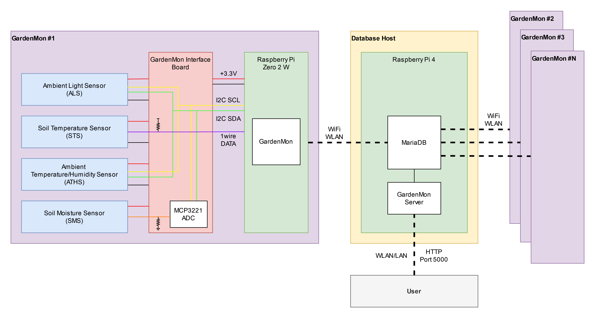

# GardenMon Server

- [GardenMon Server](#gardenmon-server)
  - [Block Diagram](#block-diagram)
  - [Database](#database)
  - [Setup](#setup)
  - [Useful Commands](#useful-commands)

## Block Diagram

The GardenMon Server is meant to serve out data from the database that holds environmental data reported by the GardenMon devices (see [gardenmon](https://github.com/anthonyneedles/gardenmon)).



## Database

See [docs/mariadb.md](./docs/mariadb.md) for info on setting up the database with MariaDB.

## Setup

1. Clone the repo and run the init script.

```
git clone https://github.com/anthonyneedles/gardenmon-server.git
cd gardenmon-server
./init.sh
```

2. Fill in `local_options.py`.
For security reasons, this file does not get tracked by git.

3. Start the GardenMon Server service with:

```
sudo systemctl start gardenmon_server
```

## Useful Commands

To start/stop/restart the service:

```
sudo systemctl start gardenmon
sudo systemctl stop gardenmon
sudo systemctl restart gardenmon
```

To observe the status of the service:

```
systemctl status gardenmon
```

To read the stdout of the service:

```
journalctl -eu gardenmon
```

To test that the server is running, call this in your browser:

```
http://192.168.10.79:5000/data?start_date=2024-03-01-00&end_date=2024-04-01-00&grouping_period=fifteen_min`
```

